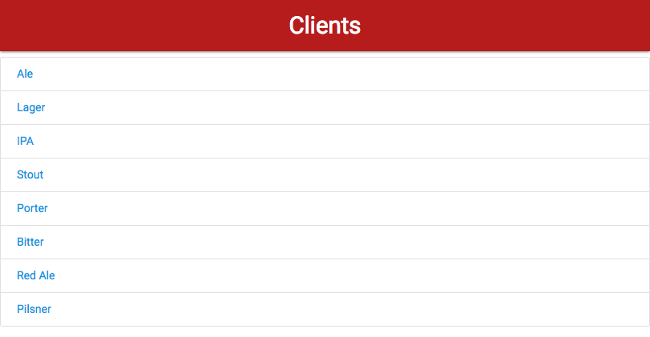
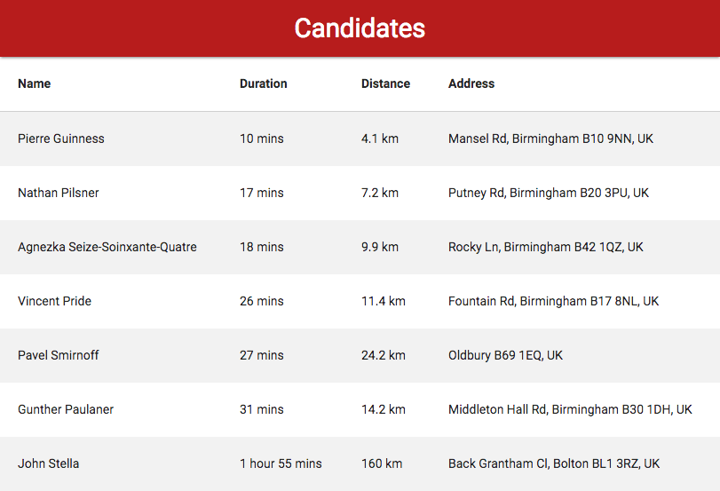

## Recruitment challenge

### User stories

```
As a user,
I want to be able to select a Client from a list,
So I can provide a Client with workers.
```
```
As a user,
I want to be able to see which Candidate is closest to the Client’s location,
So I can find the most suitable workers to send to the Client.

```
```
As a user,
I want to see the time and distance to travel to the Client based on various modes of travel,
So I can send the nearest candidate to a Client.
```

### MVP
```
User sees the lists of clients, clicks the link and sees all the candidates in order from the nearest one.
```
### Screenshots





### Usage

- You will need your Google Maps API key
- Clone repository
- cd recruitment-challenge
- Run npm install
- Run node server.js
- Run npm test for testing
- Visit localhost:3000

### Technologies

- JavaSript
- Node.js
- Express
- Jasmine
- Handlebars
- Request
- Google Distance Matrix service
- Materialize css

### Approach

I decided to solve the problem on the back end using Node, because I can keep the Google API Key hidden from the user, I can run tests on the server and avoid cross-browser differences.

1. I started with a simple server and defined the routes '/clients' and '/clients/:clientName'.
2. I built the '/clients' page and rendered the list from locations.json.
3. I built a client page that displayed a simple list of all the candidates without distance or duration.
4. I added a call to Google Maps to look up distance and travel time.
5. I sorted the candidates by duration of travel.

### Struggles

- Parsing the response from Google API
- Refactoring server.js

### Things to improve

- Add a map with pins
- Add mode of transport
- Handle error cases
- Add more tests (browser tests, API call)
- Database (so clients and candidates can be added or removed)
